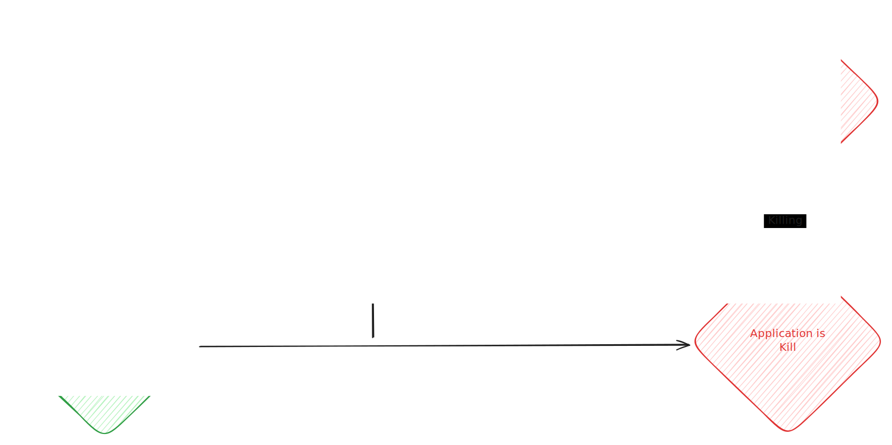

> Bundling Python applications into a single, portable binary has long been tricky—especially if you want users to just download and run your tool, without needing to install Python, set up virtual environments, or fight dependency issues. Thanks to [Reto Trappitsch (@trappitsch)](https://github.com/trappitsch) and his [`box`](https://github.com/trappitsch/box) tool (built on top of [`PyApp`](https://github.com/ofek/pyapp)), this process is finally approachable.

In this post, I’ll show how to use `box` to bundle Python inference logic (e.g., for [Nougat](https://github.com/facebookresearch/nougat)) as a sidecar in a [Tauri](https://tauri.app/) desktop app—and how to get type safety between Python and TypeScript using OpenAPI.

***

## Why bundle Python?

Shipping a single binary has several advantages:

- 🐍 **No Python required on the user’s machine**
- 💻 **Cross-platform builds** (Linux, macOS, Windows)
- 🧳 **Easy integration as a Tauri sidecar**
- 🧩 **Reproducibility** — you ship exactly the Python version and dependencies you want

`box` is a thin wrapper around `PyApp`, designed to make this whole process smooth and developer-friendly.

## How does PyApp work?

Unlike traditional bundlers like PyInstaller or shiv, [PyApp](https://github.com/ofek/pyapp) doesn’t package Python and your dependencies all together at build time. Instead, it:

1. **Compiles a minimal binary** with:
   - a minimal Python runtime (via [Cython](https://cython.org/))
   - a package manager (`uv`)
   - a list of your project dependencies
2. On **first launch**, the binary unpacks the runtime and installs your dependencies locally (just once)
3. On **subsequent runs**, it reuses the cached environment and launches instantly

> [!TIP]
> Need to update dependencies later? No need to rebuild the binary—just run `self update`.


## Step-by-step: Bundling your Python project

### 1. Prerequisites

You’ll need:

- A Python project using `pyproject.toml` (PEP 621[^pep621])
- [Rust and Cargo](https://www.rust-lang.org/tools/install) (PyApp uses them under the hood)
- [uv](https://github.com/astral-sh/uv) as your Python package manager (optional, but recommended)

### 2. Configure box in your pyproject.toml

Add `box` as a development dependency:

```shell title="Shell"
uv add --dev box-packager
```

Then configure it in your pyproject.toml:

```toml title="pyproject.toml"
[project]
name = "my_project"
version = "0.1.0"
requires-python = ">=3.12"

[project.scripts]
my_app = "my_package.main:main"

[dependency-groups]
dev = ["box-packager>=0.4.0"]

[tool.box] # [!code focus]
builder = "hatch" # or rye, pdm, etc.
is_gui = false
app_entry = "my_package.main:main" # [!code focus]
entry_type = "spec" # [!code focus]
python_version = "3.12"

[tool.box.env-vars] # [!code focus]
PYAPP_UV_ENABLED = "true" # [!code focus]
PYAPP_EXPOSE_METADATA = "false" # [!code focus]
```

Then run `box init` to initialize your project:

```shell title="Shell"
uvx --from box-packager box init
```

> [!TIP]-
> Use dev dependencies for build tools like box to keep your project reproducible and easy to set up for collaborators.

### 3. Build the binary

This will package your Python code and dependencies into a single executable:

```shell title="Shell"
uvx --from box-packager box package
```

This builds your Python project, downloads PyApp, and packages everything into a single binary using Cargo. The resulting executable will be in `target/release/`.

> [!NOTE]
> The first build may take a while, as Cargo compiles a custom binary for your project.

You might need to run `chmod +x target/release/{my_project}` to allow execution.

### 4. Run your bundled application

Once built, just run the binary:

```shell title="Shell"
./target/release/{my_project}
```

On first run, this creates a virtual environment, install dependencies, and launches your entrypoint. Subsequent runs use the cached environment.

> [!NOTE]
> The virtual environment is created in a user-specific directory (e.g., `~/Library/Application Support/pyapp/{my_project}/{uuid}/{version}/` on macOS).

### 5. Useful commands

PyApp exposes commands to manage the virtual environment:

- `./target/release/{my_project} self remove`: Remove the virtual environment
- `./target/release/{my_project} self restore`: Remove and reinstall the virtual environment
- `./target/release/{my_project} self update`: Update the virtual environment
- `./target/release/{my_project} self python`: Open an interactive Python shell with the virtual environment

> [!TIP]+
> Use `self python` to debug or inspect your environment interactively.

## Use case: a Python sidecar in Tauri

> [!NOTE]-
> This section is useful if you want to use `box` to bundle a Python application as a sidecar in a Tauri application.

Let’s say you’re building a desktop app (for example, with Tauri) and you want to run some Python logic—like ML inference behind the scenes. It's a pain to get all the dependencies and Python version right for your users, so you decide to bundle Python with your app.

In [Montelimar](https://github.com/MostlikelyAI/montelimar), I use `box` to bundle Python inference logic for [Nougat](https://github.com/facebookresearch/nougat) as a **sidecar**. In Tauri, a sidecar is an external binary shipped alongside your main Rust/JS app, often used for tasks like ML inference or system integration.



**How it works:**
- The Python FastAPI server is bundled as a single binary with `box`
- The Tauri app launches this binary as a sidecar process
- Communication happens over HTTP (localhost)

> [!WARNING]
> The Tauri application process is responsible for creating and cleaning up the sidecar. If you forget to terminate the sidecar, it may keep running in the background.

**Example build script (from `package.json`):**

```json title="package.json"
{
  // ...
  "scripts": {
    // ...
    "python:package:build": "uvx --directory src-python --from box-packager box package && mkdir -p src-tauri/binaries && for file in src-python/target/release/*; do ext=${file##*.}; [ \"$file\" = \"$ext\" ] && ext=\"\" || ext=.$ext; dest=\"src-tauri/binaries/$(basename ${file%.*})-$(rustc -Vv | grep host | cut -f2 -d' ')$ext\"; cp -f \"$file\" \"$dest\"; chmod +x \"$dest\"; done", // [!code highlight]

  }
}
```

This script builds the Python binary and copies it to the Tauri binaries folder, renaming it with the platform triple (e.g., `nougat-linux-x86_64`).

> [!NOTE]
> The platform triple in the filename helps Tauri select the correct binary for each OS/architecture.

*[platform triple]: A *platform triple* (`x86_64-apple-darwin`, etc.) identifies OS + architecture. It ensures the right binary runs on the right system.

## Type-safe integration: OpenAPI and TypeScript clients

To ensure type safety between the Python FastAPI backend and the TypeScript frontend, export the OpenAPI schema with FastAPI and generate a TypeScript client with `@hey-api/openapi-ts`:

**Python: Export OpenAPI**

```python title="src/export_openapi.py"
import json
from pathlib import Path
from fastapi.openapi.utils import get_openapi
from ocr_mlx.endpoint import app

def export_openapi(path: Path):
    with path.open("w", encoding="utf-8") as f:
        json.dump(
            get_openapi(
                title=app.title,
                version=app.version,
                openapi_version=app.openapi_version,
                description=app.description,
                routes=app.routes,
            ),
            f,
        )

if __name__ == "__main__":
    export_openapi(Path("openapi.json"))
```

And generate the OpenAPI schema:

```shell title="Shell"
python src/export_openapi.py
```

**Generate TypeScript client:**

```shell title="Shell"
bunx @hey-api/openapi-ts -i openapi.json -o src/lib/python/client -c @hey-api/client-fetch
```

This produces fully-typed TypeScript definitions and fetch clients, ensuring your frontend and backend stay in sync.

> [!IMPORTANT]
> Always regenerate your TypeScript client after making changes to your FastAPI endpoints or models to keep types in sync.

**How to use it:**
1. Generate the client:
   ```sh
   bunx @hey-api/openapi-ts -i openapi.json -o src/lib/python/client -c @hey-api/client-fetch
   ```
2. Import and use the generated functions in your frontend:
   ```ts "/* your request data fully typed! */" "res.data"
   import { someApiEndpoint } from '@/python/client/sdk.gen';

   // Example usage
   someApiEndpoint({
     body: { ... /* your request data fully typed! */ },
     baseUrl: 'http://localhost:7771',
     // fetch: customFetch // e.g., window.fetch, tauriFetch, etc.
   }).then((res) => {
     // results data is also fully typed!
     console.log(res.data);
   });
   ```

**Benefits:**
- **Type safety:** All parameters and responses are fully typed
- **Sync with backend:** The generated client stays up-to-date as your API evolves
- **Flexible:** Works with any fetch implementation and integrates easily into your frontend codebase

> [!TIP]
> Use your editor's autocompletion and type checking to catch API mismatches early!

## Conclusion

With box and PyApp, bundling Python apps is no longer a dark art. Whether you’re building CLI tools or integrating Python into a cross-platform desktop app, this toolchain delivers fast builds, clean binaries, and zero-friction setup for your users.

And if you pair it with OpenAPI-generated clients, you get a full-stack Python-to-TypeScript bridge with type safety all the way down.

**Links:**
- [box on GitHub](https://github.com/trappitsch/box)
- [PyApp on GitHub](https://github.com/ofek/pyapp)
- [Montelimar](https://github.com/MostlikelyAI/montelimar)
- [Nougat](https://github.com/facebookresearch/nougat)
- [Tauri](https://tauri.app/)


[^pep621]: [PEP 621](https://peps.python.org/pep-0621/) defines a standardized way to declare metadata like name, version, and dependencies in `pyproject.toml`.


