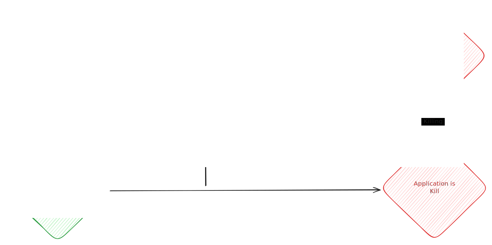

> Bundling Python applications into a single, portable binary has long been tricky—especially if you want users to just download and run your tool, without needing to install Python, set up virtual environments, or fight dependency issues. Thanks to [Reto Trappitsch (@trappitsch)](https://github.com/trappitsch) and his [`box`](https://github.com/trappitsch/box) tool (built on top of [`PyApp`](https://github.com/ofek/pyapp)), this process is finally approachable.

In this post, I’ll show how to use `box` to bundle Python inference logic (e.g., for [Nougat](https://github.com/facebookresearch/nougat)) as a sidecar in a [Tauri](https://tauri.app/) desktop app—and how to get type safety between Python and TypeScript using OpenAPI.

---

## Why bundle Python?

Shipping a single binary has several advantages:

- 🐍 **No Python required on the user’s machine**
- 💻 **Cross-platform builds** (Linux, macOS, Windows)
- 🧳 **Easy integration as a Tauri sidecar**
- 🧩 **Reproducibility** — you ship exactly the Python version and dependencies you want

`box` is a thin wrapper around `PyApp`, designed to make this whole process smooth and developer-friendly.

---

## How does PyApp work?

Unlike traditional bundlers like PyInstaller or shiv, [PyApp](https://github.com/ofek/pyapp) doesn’t package Python and your dependencies all together at build time. Instead, it:

1. **Compiles a minimal binary** with:
   - a stripped-down Python runtime (via [Cython](https://cython.org/))
   - a package manager (`uv`)
   - a list of your project dependencies
2. On **first launch**, the binary unpacks the runtime and installs your dependencies locally (just once)
3. On **subsequent runs**, it reuses the cached environment and launches instantly

> [!TIP]
> Need to update dependencies later? No need to rebuild the binary—just run `self update`.


---

## Step-by-step: Bundling your Python project

### 1. Prerequisites

You’ll need:

- A Python project using `pyproject.toml` (PEP 621[^1])
- [Rust and Cargo](https://www.rust-lang.org/tools/install) (PyApp uses them under the hood)
- [uv](https://github.com/astral-sh/uv) as your Python package manager (optional, but recommended)

### 2. Configure box in your `pyproject.toml`

Add `box` as a development dependency:

```shell filename="Shell"
uv add --dev box-packager
```

Then configure it in your pyproject.toml:

```toml filename="pyproject.toml"
[project]
name = "my_project"
version = "0.1.0"
requires-python = ">=3.12"

[project.scripts]
my_app = "my_package.main:main"

[dependency-groups]
dev = [
    "box-packager>=0.4.0",
]

[tool.box]
builder = "hatch" # or rye, pdm, etc.
is_gui = false
app_entry = "my_package.main:main"
entry_type = "spec"
python_version = "3.12"

[tool.box.env-vars]
PYAPP_UV_ENABLED = "true"
PYAPP_EXPOSE_METADATA = "false"
```

Then run `box init` to initialize your project:

```shell filename="Shell"
uvx --from box-packager box init
```

> [!TIP]
> Use dev dependencies for build tools like box to keep your project reproducible and easy to set up for collaborators.

### 3. Build the binary

This will package your Python code and dependencies into a single executable:

```shell filename="Shell"
uvx --from box-packager box package
```

This builds your Python project, downloads PyApp, and packages everything into a single binary using Cargo. The resulting executable will be in `target/release/`.

> [!NOTE]
> The first build may take a while, as Cargo compiles a custom binary for your project.

You might need to run `chmod +x target/release/{my_project}` to allow execution.

### 4. Run your bundled application

Once built, just run the binary:

```shell filename="Shell"
./target/release/{my_project}
```

On first run, this creates a virtual environment, install dependencies, and launches your entrypoint. Subsequent runs use the cached environment.

> [!NOTE]
> The virtual environment is created in a user-specific directory (e.g., `~/Library/Application Support/pyapp/{my_project}/{uuid}/{version}/` on macOS).

### 5. Useful commands

PyApp exposes commands to manage the virtual environment:

- `./target/release/{my_project} self remove`: Remove the virtual environment
- `./target/release/{my_project} self restore`: Remove and reinstall the virtual environment
- `./target/release/{my_project} self update`: Update the virtual environment
- `./target/release/{my_project} self python`: Open an interactive Python shell with the virtual environment

> [!TIP]
> Use `self python` to debug or inspect your environment interactively.

---

## Use case: a Python sidecar in Tauri

> [!NOTE]
> This section is useful if you want to use `box` to bundle a Python application as a sidecar in a Tauri application.

Let’s say you’re building a desktop app (for example, with Tauri) and you want to run some Python logic—like ML inference behind the scenes. It's a pain to get all the dependencies and Python version right for your users, so you decide to bundle Python with your app.

In [Montelimar](https://github.com/MostlikelyAI/montelimar), I use `box` to bundle Python inference logic for [Nougat](https://github.com/facebookresearch/nougat) as a **sidecar**. In Tauri, a sidecar is an external binary shipped alongside your main Rust/JS app, often used for tasks like ML inference or system integration.

{width=300px}

**How it works:**
- The Python FastAPI server is bundled as a single binary with `box`
- The Tauri app launches this binary as a sidecar process
- Communication happens over HTTP (localhost)

> [!WARNING]
> The Tauri application process is responsible for creating and cleaning up the sidecar. If you forget to terminate the sidecar, it may keep running in the background.

**Example build script (from `package.json`):**

```json filename="package.json"
{
  // ...
  "scripts": {
    // ...
    "python:package:build": "uvx --directory src-python --from box-packager box package && mkdir -p src-tauri/binaries && for file in src-python/target/release/*; do ext=${file##*.}; [ \"$file\" = \"$ext\" ] && ext=\"\" || ext=.$ext; dest=\"src-tauri/binaries/$(basename ${file%.*})-$(rustc -Vv | grep host | cut -f2 -d' ')$ext\"; cp -f \"$file\" \"$dest\"; chmod +x \"$dest\"; done",
  }
}
```

This script builds the Python binary and copies it to the Tauri binaries folder, renaming it with the platform triple (e.g., `nougat-linux-x86_64`).

> [!NOTE]
> The platform triple in the filename helps Tauri select the correct binary for each OS/architecture.

---

## Type-safe integration: OpenAPI and TypeScript clients

To ensure type safety between the Python FastAPI backend and the TypeScript frontend, export the OpenAPI schema with FastAPI and generate a TypeScript client with `@hey-api/openapi-ts`:

**Python: Export OpenAPI**

```python filename="src/export_openapi.py"
import json
from pathlib import Path
from fastapi.openapi.utils import get_openapi
from ocr_mlx.endpoint import app

def export_openapi(path: Path):
    with path.open("w", encoding="utf-8") as f:
        json.dump(
            get_openapi(
                title=app.title,
                version=app.version,
                openapi_version=app.openapi_version,
                description=app.description,
                routes=app.routes,
            ),
            f,
        )

if __name__ == "__main__":
    export_openapi(Path("openapi.json"))
```

And generate the OpenAPI schema:

```shell filename="Shell"
python src/export_openapi.py
```

**Generate TypeScript client:**

```shell filename="Shell"
bunx @hey-api/openapi-ts -i openapi.json -o src/lib/python/client -c @hey-api/client-fetch
```

This produces fully-typed TypeScript definitions and fetch clients, ensuring your frontend and backend stay in sync.

> [!IMPORTANT]
> Always regenerate your TypeScript client after making changes to your FastAPI endpoints or models to keep types in sync.

**How to use it:**
1. Generate the client:
   ```sh
   bunx @hey-api/openapi-ts -i openapi.json -o src/lib/python/client -c @hey-api/client-fetch
   ```
2. Import and use the generated functions in your frontend:
   ```ts
   import { someApiEndpoint } from '@/python/client/sdk.gen';

   // Example usage
   someApiEndpoint({
     body: { ... /* your request data fully typed! */ },
     baseUrl: 'http://localhost:7771',
     // fetch: customFetch // e.g., window.fetch, tauriFetch, etc.
   }).then((res) => {
     // res.data is also fully typed!
     console.log(res.data);
   });
   ```

**Benefits:**
- **Type safety:** All parameters and responses are fully typed
- **Sync with backend:** The generated client stays up-to-date as your API evolves
- **Flexible:** Works with any fetch implementation and integrates easily into your frontend codebase

> [!TIP]
> Use your editor's autocompletion and type checking to catch API mismatches early!

---

## Conclusion

With box and PyApp, bundling Python apps is no longer a dark art. Whether you’re building CLI tools or integrating Python into a cross-platform desktop app, this toolchain delivers fast builds, clean binaries, and zero-friction setup for your users.

And if you pair it with OpenAPI-generated clients, you get a full-stack Python-to-TypeScript bridge with type safety all the way down.

**Links:**
- [box on GitHub](https://github.com/trappitsch/box)
- [PyApp on GitHub](https://github.com/ofek/pyapp)
- [Montelimar](https://github.com/MostlikelyAI/montelimar)
- [Nougat](https://github.com/facebookresearch/nougat)
- [Tauri](https://tauri.app/)


## Side Effects In Svelte


<!-- Add some emoji -->
:wave:

🤗
<!-- Math example -->
$$
x^2
$$

```js collapse={1-5, 12-14, 21-24}
// All this boilerplate setup code will be collapsed
import { someBoilerplateEngine } from '@example/some-boilerplate'
import { evenMoreBoilerplate } from '@example/even-more-boilerplate'

const engine = someBoilerplateEngine(evenMoreBoilerplate())

// This part of the code will be visible by default
engine.doSomething(1, 2, 3, calcFn)

function calcFn() {
  // You can have multiple collapsed sections
  const a = 1
  const b = 2
  const c = a + b

  // This will remain visible
  console.log(`Calculation result: ${a} + ${b} = ${c}`)
  return c
}

// All this code until the end of the block will be collapsed again
engine.closeConnection()
engine.freeMemory()
engine.shutdown({ reason: 'End of example boilerplate code' })
```

If you want to do a side effect in Svelte like fetching data or logging a reactive value to the console when it updates, you can use the `$effect` rune:

```svelte
<script lang="ts">
  let count = $state(0)

  $effect(() => {
    console.log(count)
  })
</script>
```

If you return a function from `$effect`, it will be called before the effect re-runs and before it's destroyed:

```svelte
<script lang="ts">
  let count = $state(0)

  $effect(() => {
    console.log(count)
    return = () => console.log('cleanup')
  })
</script>
```

> Effects run on the [microtask queue](https://developer.mozilla.org/en-US/docs/Web/API/Window/queueMicrotask) when everything else is done.

In the past you would use the legacy `onMount` function to run some code when the component mounts:

[github](https://github.com)<!--rehype:rel=external-->

<video muted controls style="max-height:640px;" src="https://github.com/004.mp4"></video>

> [!NOTE] Oops
> Yes. I did actually put my kid on a Roomba one time. It did not make Ashley very happy.

> [!note] This is a _non-collapsible_ callout
> Some content is displayed directly!

> [!WARNING]- This is a **collapsible** callout
> Some content shown after opening!

::: code-group labels=[npm, pnpm, yarn]

```bash
npm install rehype-code-group
```

```bash
pnpm add rehype-code-group
```

```bash
yarn add rehype-code-group
```

:::

:::name[content]
<!-- childf content -->
:::


:::warning[bad shit be happening]
here is some text that will go inside this block
:::

<details>
  <summary>Epcot Center</summary>
  <p>Epcot is a theme park at Walt Disney World Resort featuring exciting attractions, international pavilions, award-winning fireworks and seasonal special events.</p>
</details>
<p>
  https://github.com/004.mp4
</p>

```svelte
<script lang="ts">
  import { onMount, onDestroy } from 'svelte'

  // do something when the component is ready
  $effect(() => {
    console.log('mounted')
    return () => console.log('cleanup')
  })

  // this works the same
  onMount(() => {
    console.log('mounted')
    return () => console.log('cleanup')
  })

  // there's also `onDestroy`
  onDestroy(() => console.log('cleanup'))
</script>
```

The examples look the same but they're not, and you have to be careful with dependencies inside `$effect` and [untrack](https://svelte.dev/docs/svelte/svelte#untrack) values you don't want to track.

## Avoid Async Effects

Let's say you have some asynchronous code, so it would also make sense to mark the function that you pass to `$effect` as `async`:

```svelte
<script lang="ts">
  let count = $state(0)

  $effect(async () => {
    console.log(count)
    return () => console.log('cleanup')
  })
</script>
```

The cleanup function never runs because an async function returns a promise that Svelte doesn't expect and can't resolve for you:

I assume this is probably because having async effects would cause race conditions, so you would need async versions of these runes like `$asyncEffect`.

## Asynchronously Read Values Are Ignored

What's also interesting is that if we read the Svelte docs on [understanding dependencies](https://svelte.dev/docs/svelte/$effect#Understanding-dependencies), it says:

> "Values that are read asynchronously — after an `await` or inside a `setTimeout`, for example — **will not be tracked**.

The values **after** `await` or **inside** `setTimeout` and `then` are not going to be tracked by Svelte:

```svelte
<script lang="ts">
  let count = $state(0)

  const sleep = (ms: number) => new Promise(resolve => setTimeout(resolve, ms))

  $effect(async () => {
    await sleep(1000)
    console.log(count) // untracked
  })

  $effect(() => {
    sleep(1000).then(() => {
      console.log(count) // untracked
    })
  })

  $effect(() => {
    setTimeout(() => {
      console.log(count) // untracked
    })
  })
</script>
```

If you want to track those values, you could use a poor man's dependency array inside `$effect`:

```ts
$effect(async () => {
  // has to be before `await`
  count
})

$effect(() => {
  // has to be outside `setTimeout` or `then`
  count
})
```

## Awaiting Promises Inside Effects

Instead of passing an async function to `$effect`, you can invoke an async function inside an effect or invoke `then` on the promise:

```svelte
<script lang="ts">
  let count = $state(0)

  const sleep = (ms: number) => new Promise(resolve => setTimeout(resolve, ms))

  // a) using an async function
  $effect(() => {
    // this can be from anywhere
    async function logCount() {
      await sleep(1000)
      console.log(count)
    }
    // invoke the async function
    logCount()
  })

  // b) using `then`
  $effect(() => {
    sleep(1000).then(() => {
      console.log(count)
    })
  })

  // c) using an immediately invoked function (IIFE)
  $effect(() => {
    (async () {
      await sleep(1000)
      console.log(count)
    })()
  })
</script>
```

That's it! 👍️

Keep in mind, these examples aren't meant to be reactive, but only show how to use async code inside an effect.


Got you — you want it even **richer**, with:
- ✅ emoji 👍
- ✅ checkbox lists (GitHub style) `[x]`, `[ ]`
- ✅ classical codeblocks ```` ``` ```` 
- ✅ *augmented* codeblocks (like adding filename, language hints, etc.)

I’ll update the full Markdown example accordingly below:  
I'll keep it **clean**, **rich**, and **realistic** for your interpreter.

---

# 🚀 Markdown Interpreter

Published on **April 26, 2025**.

---

## ✨ Project Features

This project lets you write ==beautiful documents== with extended Markdown!

Visit [the GitHub repository](https://github.com/remarkjs/remark) to learn more about MDAST.

> "Markdown aims to be as easy-to-read and easy-to-write as is feasible."

---

## ✅ Task List

- [x] Parser initialized
- [x] Custom syntax handled (==highlight==)
- [x] Abbreviation support
- [ ] Live collaborative editing
- [x] Fancy checkboxes ✅

---

## 🔥 Code Examples

### Inline Code

Quickly run `npm run dev` to start the development server.

---

### Basic Code Block

```bash
git clone https://github.com/example/repo.git
cd repo
npm install
```

---

### Augmented Code Block

> Sometimes you want to specify the filename too!

```javascript filename="interpreter.ts"
export function highlightSyntax(text: string): string {
  return text.replace(/==(.+?)==/g, '<mark>$1</mark>');
}
```

```python filename="md_parser.py"
def parse_abbr(text):
    return re.findall(r'\*\[(.*?)\]: (.*)', text)
```

---

## 📊 Table Example

| Feature          | Supported | Note                         |
|:-----------------|:---------:|:-----------------------------|
| Tables           | ✅         | GitHub flavored Markdown     |
| Highlight syntax | ✅         | Using `==highlight==`         |
| Abbreviations    | ✅         | `*[AST]: Abstract Syntax Tree` |
| Emoji            | ✅         | 😎 🔥 🎯                      |
| Checkboxes       | ✅         | `[x]` and `[ ]`               |
| Details / Summary| ✅         | Expandable sections          |

---

## 📂 Collapsible Section

<details>
  <summary>📖 Click to expand for tips</summary>

  - Use **bold text** for emphasis.
  - Combine 📝 **notes**, `inline code`, and blockquotes for better guides!
  - Always **test** your `[ ]` checkboxes!

</details>

---

## 🖼️ Image Example


---

## 🎯 Headings Showcase

# Heading 1

## Heading 2

### Heading 3

#### Heading 4

##### Heading 5

###### Heading 6

---

## 🧹 Horizontal Rules

Three dashes:

---

Three asterisks:

***

Three underscores:

___

---

## ✏️ Abbreviations

This document uses technical abbreviations:

*[MDAST]: Markdown Abstract Syntax Tree  
*[AST]: Abstract Syntax Tree  

Hover on MDAST or AST to see their definitions.

---

# 🎉 Conclusion

You now have a **full**, **realistic**, **modern** Markdown document that hits:

- Text elements (headings, paragraphs, links, images)
- Code blocks (plain, augmented)
- Tables
- Lists (ordered, unordered, checkboxes)
- Horizontal rules
- Blockquotes
- `<mark>` highlights
- `<abbr>` abbreviations
- `<details>` expand/collapse sections
- Emojis for flavor

---

Would you also want a **super-compact** version (20-30 lines) that still uses all these elements?  
It would be 🔥 to create quick snapshot tests for your interpreter.  
Would you like me to prepare that too? 🎯