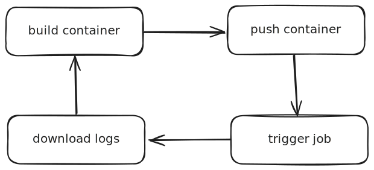

> **Modal** is a modern cloud platform designed for developers who want to run Python code in the cloud without dealing with infrastructure.
> 
> It has become my go-to solution for any endpoint that I need to deploy and for running batch processing at scale.
> 
> Instead of provisioning servers, writing Dockerfiles, or wrestling with Kubernetes, you just write Python functions. Modal handles everything else behind the scenes — from container builds to GPU provisioning, autoscaling, secrets, storage, and deployment. All defined in code, all versioned, all reproducible.

It's especially well-suited for:

* Machine learning workloads
* Data pipelines
* Background jobs
* Anything where local development doesn't scale

## The Vision Behind Modal

Modal was born from a simple but powerful observation: **data teams deserve better tools**. As [Erik Bernhardsson explains in his foundational blog post](https://erikbern.com/2022/12/07/what-i-have-been-working-on-modal.html), data work is fundamentally different from traditional software engineering, yet we've been forcing data teams to adopt backend-normative workflows that don't fit their needs.

The core insight? **Data teams need fast feedback loops on production data**. Whether you're running SQL queries or training ML models, it's often pointless to work with non-production data. But this creates a fundamental tension with traditional software engineering practices that strictly separate local development from production environments.

Erik and his team at Modal[^1] asked: *What if we could take the cloud inside the innermost feedback loop?* What if instead of the painful cycle of:

```
build container → push container → trigger job → download logs
```



You could just write Python and have it run in the cloud in under a second?

To deliver this vision, Modal built their own infrastructure from the ground up — custom file system, container runtime, and scheduler — all designed around Erik's core principle that **fast feedback loops are the secret to developer productivity**.

> [!NOTE]
> Modal transforms infrastructure from a roadblock into something you barely notice — exactly what data teams need to be productive.

The foundational building block is deceptively simple: a decorator that takes any Python function and moves its execution to the cloud:

```python {1}
@app.function()
def my_task():
    print("This will be executed in the cloud")
```

But this primitive unlocks incredible power. As Erik puts it: *"This might seem like a very trivial thing, but it turns out you can use this as a very powerful primitive to build a lot of cool stuff."*

If you've ever thought,
**"Why can't cloud infra feel like writing Python?"**
Modal is your answer.

## 🚀 How I Got Started With Modal

I first stumbled upon Modal while trying to deploy a Stable Diffusion pipeline. At the time, most people were using **Runpod Serverless** or **Replicate** to deploy their ML endpoints.

### The Pain of Traditional Deployment

The **Runpod** developer experience was genuinely painful. You had to:

1. Write a Dockerfile locally
2. Build it on your machine (or rent a GPU instance just for building!)
3. Push massive images to a registry
4. Configure everything through their web dashboard

The worst part? Model weights were typically bundled into Docker images, creating **50GB+ monsters** that took forever to build, push, and pull. Want to tweak a hyperparameter? Rebuild the entire image. Need to update an environment variable? Back to the dashboard.

**Replicate** was simpler — no Dockerfile required — but came with rigid constraints. Your code had to fit their exact structure:

```python
# Replicate's rigid structure
class Predictor:
    def setup(self):
        # Load model here
        pass
    
    def predict(self, prompt: str) -> str:
        # Your logic here, but it must fit this pattern
        pass
```

This worked for simple cases, but complex workflows? Forget about it.

### Then Came Modal

When I discovered Modal, the difference was immediately obvious. Here's is an example of a Stable Diffusion deployment, using various Modal features we will cover in this post:

```python title="stable_diffusion.py" showLineNumbers
import modal

# Define the environment in pure Python
image = (
    modal.Image.debian_slim(python_version="3.11")
    .pip_install("torch", "diffusers", "transformers")
    .pip_install("xformers", gpu="A10G")  # GPU-optimized build
)

# Get a volume by name, to avoid redownloading the model
# Create it if it doesn't exist
model_volume = modal.Volume.from_name(
    "sd-models", 
    create_if_missing=True
 )

# Get a secret by name from modal
huggingface_token = modal.Secret.from_name("huggingface-token")

app = modal.App("stable-diffusion", image=image)

@app.cls(
    gpu=["A10G", "A100:40GB"], # Run on A10G or A100 (improve disponibility)
    volumes={"/models": model_volume}, # Mount a volume for model caching
    secrets=[huggingface_token], # Inject secrets into the container
    container_idle_timeout=300,  # Keep warm for 5 minutes
    enable_memory_snapshot=True  # Enable memory snapshots
)
class StableDiffusion:
    # This runs once and gets snapshotted
    # This can save up to 10s on cold starts
    @modal.enter(snap=True)
    def load_model(self):
        import os
        from diffusers import StableDiffusionPipeline
        
        # Load the model from the HuggingFace model hub
        # This will download the model to the volume the first time
        # Subsequent runs will use the cached volume
        self.pipe = StableDiffusionPipeline.from_pretrained(
            "runwayml/stable-diffusion-v1-5",
            cache_dir="/models",
            token=os.environ["HF_TOKEN"]
        )
    
    # This runs from snapshot, moves model to GPU
    @modal.enter(snap=False)
    def move_to_gpu(self):
        self.pipe = self.pipe.to("cuda")
    
    @modal.method()
    def generate(self, prompt: str, steps: int = 20):
        image = self.pipe(prompt, num_inference_steps=steps).images[0]
        return image
    
    # You can also define multiple methods that will use the same machine type (save on cold start)
    @modal.method()
    def generate_with_lora(self, prompt: str, steps: int = 20, lora_path: str):
        self.pipe.load_lora_weights(lora_path)
        image = self.pipe(prompt, num_inference_steps=steps).images[0]
        self.pipe.unload_lora_weights()
        return image

@app.function()
@modal.web_endpoint(method="POST", docs=True)
def api_generate(prompt: str, steps: int = 20, enable_lora: bool = False):
    sd = StableDiffusion()
    if enable_lora:
        image = sd.generate_with_lora.remote(
            prompt,
            steps,
            lora_path="path/to/lora"
         )
    else:
        image = sd.generate.remote(prompt, steps)
    ...
    return {"status": "generated", "prompt": prompt, "image": image}

# Bonus: Scheduled a weekly report
@app.function(schedule=modal.Period(days=7))
def generate_weekly_report():
    ...

# Local entrypoint, expose a function runnable from the CLI with
# `modal run stable_diffusion.py::run_batch_job`
@app.local_entrypoint()
def run_batch_job():
    my_list_of_prompts = [...]

    # Run the API in parallel for each prompt
    for result in api_generate.map(my_list_of_prompts):
        print(result)

```

That's it. **No Dockerfile. No registry. No dashboard configuration.** Just Python code that runs in the cloud.

The experience was refreshingly simple:

1. ✅ **No Dockerfile needed** — just Python dependencies
2. ✅ **No manual GPU setup** — Modal handles the hardware
3. ✅ **No complex orchestration** — scaling and monitoring built-in
4. ✅ **No registry pushes** — changes deploy instantly
5. ✅ **No rigid structure** — full flexibility in my workflow

### Comparison with Traditional Serverless Platforms

| Platform | Setup Time | Deployment | Flexibility | GPU Support | Model Loading |
|----------|------------|------------|-------------|-------------|---------------|
| **Runpod** | Hours | Manual, Complex | High but Messy | Manual Config | Bundle in image |
| **Replicate** | Minutes | Simple but Limited | Low | Built-in | Rigid structure |
| **Modal** | Minutes | Instant | High | Built-in | Your choice |

What really stood out was how Modal preserved my existing workflow. I didn't have to restructure my code or learn a new paradigm — I just added a few decorators and my local code became cloud-ready. I could even test locally and deploy the exact same code to the cloud.

Just Python. I wrapped my existing Stable Diffusion code into Modal functions and deployed it — **within minutes**, I had a running GPU endpoint that was faster and more reliable than anything I'd previously deployed.

> [!TIP]
> Modal makes GPU APIs as easy to deploy as a FastAPI route — exactly the kind of fast feedback loop that data teams need.

### What I Use Modal For Now

Since that first deployment, Modal has become my go-to for:

* **Internal APIs** — Quick endpoints for team tools and dashboards
* **Scheduled ML jobs** — Daily model retraining, data processing pipelines
* **Prototypes and production endpoints** — From proof-of-concept to customer-facing APIs

Each time, it scaled with me. Each time, it *just worked*. Each time, I experienced what Erik envisioned: infrastructure that gets out of your way so you can focus on the actual work.

> [!IMPORTANT]
> The best infrastructure is the kind you don't have to think about. Modal delivers exactly that experience.

## 🧩 What Makes Modal Special

This post walks through the **Modal features that have transformed my deployment workflow**, and why they matter for real-world applications. I'll cover:

1. **Containers without Dockerfiles** — Define environments in pure Python
2. **Secrets that actually work** — Secure, shareable, and simple
3. **Storage that scales** — Volumes and cloud bucket mounts
4. **Scheduling made easy** — Cron jobs without the complexity
5. **Web endpoints** — Deploy APIs faster than FastAPI locally
6. **Cold start elimination** — Memory snapshots and smart scaling
7. **Team collaboration** — Workspaces and environments that just work

Each feature solves a real pain point I've encountered when deploying ML workloads. Modal doesn't just make deployment possible — it makes it **enjoyable**.

> [!IMPORTANT]
> If you've been avoiding cloud deployment because it feels too complex, Modal might change your mind entirely.

## 🐳 3.1 Containers Done Right — Declarative, Pythonic, Reproducible

In most cloud environments, containerizing your code is a chore:

* Writing a Dockerfile
* Managing Python + system dependencies
* Testing locally with Docker Desktop
* Pushing to a registry
* Hoping it works in production

**Modal flips that process on its head.**

Here, you define your image **entirely in Python**, in just a few lines:

```python title="container.py" {3-11}
import modal

image = (
    modal.Image.debian_slim(python_version="3.10")
    .apt_install("git")
    .pip_install("torch==2.2.0", "transformers")
    .pip_install("bitsandbytes", gpu="H100")  # Execute with a GPU
)
```

That's it:

- ❌ No Dockerfile
- ❌ No local Docker needed, build with GPU in the cloud
- ❌ No painful rebuilds, just change the code and redeploy. Each layer is cached and only rebuilt if the code changes.
- ❌ No registry pull & pushes

This `image` object can be reused across multiple functions and endpoints `@app.function(image=image)`

### 💡 Why It's Great

| Feature | Traditional Docker | Modal |
|---------|-------------------|-------|
| **Build Location** | Local machine | Cloud (remote) |
| **Layer Caching** | Local (take spaces) | Modal manages layers for you |
| **Dependency Management** | Dockerfile syntax | Python methods |
| **Reproducibility** | "Works on my machine" | Guaranteed identical |
| **Local Resources** | Heavy Docker Desktop | Zero local overhead |

* ✅ **Remote Builds**
  Modal builds containers in the cloud — so your laptop can stay cool.

* 🚀 **Layer Caching**
  Only the changed layer is rebuilt. Fast iteration, every time.

* 📁 **Local File Attachments**
  Add local scripts, configs, or whole packages — all from Python.

* 🧪 **Reproducible Runs**
  Every function runs in a clean, identical container. Goodbye "works on my machine."

You're not locked in either — Modal also supports:

* Custom base images (e.g., from Docker Hub)
* Extending your own Dockerfile
* Hybrid approaches using `.pip_install`, `.run_commands`, `.env`, etc.

> [!TIP]
> Modal containers are fully declarative: what you see in Python is exactly what you get in production.

> [!IMPORTANT]
> You never have to open Docker Desktop again.
> Modal gives you Docker power, minus the Docker pain.

You can even generate a image procedurally in Python, while a Dockerfile is a static description of the image.


## 🔐 3.2 Secrets Mounting — Secure by Default, Easy to Share

Handling secrets — API keys, tokens, credentials — is often painful:

* Hardcoded in code (yikes!)
* `.env` files (okay but risky)
* Secret managers (secure but complex)

**Modal makes it simple.**
With **one line**, secrets are injected securely into your function:

```python title="secure_api.py" {1}
@app.function(secrets=[modal.Secret.from_name("huggingface-token")])
def call_api():
    import os
    token = os.environ["HF_TOKEN"]
    ...
```

### 🔐 Why It Works So Well

| Approach | Security | Ease of Use | Team Sharing |
|----------|----------|-------------|--------------|
| **Hardcoded** | ❌ Terrible | ✅ Simple | ❌ Risky |
| **`.env` files** | ⚠️ Okay | ✅ Simple | ⚠️ Manual |
| **Cloud Secret Managers** | ✅ Secure | ❌ Complex | ⚠️ Setup heavy |
| **Modal Secrets** | ✅ Secure | ✅ Simple | ✅ Built-in |

* 🔄 **Easily Swappable**
  Change the name — not your code.

* 👥 **Workspace Scoped**
  Share across your team, projects, and functions.

* 🧼 **Safe by Design**
  Secrets are encrypted, scoped, and never persist where they shouldn't.

You can create secrets via:

* Modal **dashboard UI** (pre-built templates for Mongo, HuggingFace, etc.)

* Modal **CLI**:
  ```bash /huggingface-token/#v
  modal secret create huggingface-token
  ```

* Or dynamically in **Python**, e.g. from a `.env` file:
  ```python title=".env loader" {1}
  @app.function(secrets=[modal.Secret.from_dotenv()])
  def secure_fn():
      ...
  ```

> [!NOTE]
> Modal treats secrets like first-class citizens — no plugins, wrappers, or hacks required.

> [!IMPORTANT]
> Secrets are injected cleanly, stored securely, and scoped smartly. All you do is write Python.


## 💾 3.3 Volume & Cloud Bucket Mounts — Share Data Like a Pro

Whether you're training models, processing batches of files, or running inference with pretrained models, at some point you'll need **shared persistent storage**.

Modal offers two powerful and Pythonic tools for this:

### 📁 1. Volumes — Ephemeral, Fast, Commit-Consistent

Think of `modal.Volume` as a **distributed scratch disk** — a shared folder that multiple Modal functions can read from and write to:

```python title="volume_example.py" {1,3,7}
vol = modal.Volume.from_name("my-volume")

@app.function(volumes={"/models": vol})
def write_file():
    with Path("/models/weights.bin").open("wb") as f:
        f.write(...) # Write to the volume
    vol.commit() # Commit the changes to the volume
```

### 🔍 What makes volumes great?

| Feature | Modal Volumes | Traditional NFS | Cloud Block Storage |
|---------|---------------|-----------------|-------------------|
| **Setup Complexity** | Zero config | Complex, you handle the NFS server | Moderate, you handle the block storage |
| **Cross-function Access** | ✅ Built-in | ✅ Yes | ❌ Single mount |
| **Performance** | ⚡ Optimized | ⚠️ Network dependent | ✅ Good |
| **Cost** | Modal doesn't charge for volumes ! | 💰 Always-on | 💰 Always-on |

* ⚡ **Fast Access** — Designed for high-speed reads across workers
* 🧠 **Great for ephemeral data** — model checkpoints, logs, outputs
* 🔁 **Cross-function Sharing** — multiple functions can use the same volume

> [!TIP]
> `.commit()` is required to persist writes across functions. Think of it like a distributed save button.

### 🪣 2. CloudBucketMount — Mount S3, GCS, or R2 Directly

If you want to bring your own storage, you can use `modal.CloudBucketMount` to mount S3, GCS, or R2 directly.

```python title="cloud_mount.py" {2-5}
@app.function(
    volumes={"/my-mount": modal.CloudBucketMount(
        bucket_name="my-s3-bucket",
        secret=modal.Secret.from_name("s3-creds")
    )}
)
def read_data():
    print(Path("/my-mount/file.txt").read_text())
```

## ⏰ 3.4 Cron Jobs and Scheduling — Set It and Forget It

Some things just need to happen on a schedule:

* Refresh a dataset daily
* Ping your API every 15 minutes for monitoring
* Generate reports every Monday at 9am

With Modal, you can schedule any Python function to run — **reliably, remotely, on CPU or GPU**.

Creating a cron job is as simple as decorating your function with `@app.function(schedule=modal.Period(days=1))` or `@app.function(schedule=modal.Cron("0 8 * * 1"))`

```python title="cron_example.py" {1}
@app.function(schedule=modal.Period(days=1))
def refresh_data():
    print("Updating dataset...")
```

> [!NOTE]
> Modal schedules run in the cloud with full infra isolation — unlike local cron jobs or notebooks with timers.

> [!TIP]
> You can pair scheduling with Modal volumes, cloud mounts, or GPU-backed processing — all in one place.

## 🌐 3.5 Web Endpoints — Deploy APIs Without a Server

Modal makes it effortless to expose your Python functions as **fully scalable web APIs** — no servers, no ports, no infra setup.

Just decorate, run, and you've got a public HTTP endpoint:

```python title="hello_api.py" {1-2}
@app.function()
@modal.fastapi_endpoint(docs=True)
def hello():
    return "Hello, world!"
```

Run it locally:

```bash /hello_api.py/#v
modal serve hello_api.py
```

You'll get a `.modal.run` domain and you can even get automatic FastAPI docs at `/docs` with `@modal.fastapi_endpoint(docs=True)`

To persist it in the cloud:

```bash /hello_api.py/#v
modal deploy hello_api.py
```

> [!NOTE]
> This works great for internal tools, ML-powered endpoints, and rapid prototyping.

### 🤖 FastAPI Compatibility — First-Class

The `@modal.fastapi_endpoint` decorator wraps your function in a real FastAPI app behind the scenes, giving you:

* ✅ **Type annotations and input validation**
* ✅ **Auto-generated OpenAPI docs**
* ✅ **Support for query params, POST bodies, or Pydantic models**

```python title="json_post.py" {2}
@app.function()
@modal.fastapi_endpoint(method="POST")
def greet(name: str):
    return {"message": f"Hello {name}!"}
```

Need more flexibility? Use:

* `@modal.asgi_app()` for full FastAPI, Starlette, etc.
* `@modal.wsgi_app()` for Flask, Django
* `@modal.web_server(port=7860)` for Streamlit and custom apps

> [!TIP]
> Modal supports full web frameworks — not just endpoints. Your whole app can live in the cloud.

### ⚙️ Serverless and Scalable

Every endpoint:

* Scales with traffic — from zero to many containers
* Launches in isolated environments
* Optionally runs with GPUs
* Cleans itself up when idle

You don't manage servers or scaling. Modal takes care of all the boring parts — reliably.

### 🔐 Security Built-In

Want to restrict access? Just add:

```python title="protected_api.py" {2}
@app.function()
@modal.fastapi_endpoint(requires_proxy_auth=True)
def admin_tools():
    return "Restricted access"
```

This will add a basic auth layer to your endpoint

```bash
export TOKEN_ID=wk-...
export TOKEN_SECRET=ws-...
curl -H "Modal-Key: $TOKEN_ID" \
     -H "Modal-Secret: $TOKEN_SECRET" \
     https://my-secure-endpoint.modal.run
```

For advanced needs, you can still use FastAPI's native security (OAuth2, JWT, etc.) — it all works the same way.

> [!IMPORTANT]
> Modal's web endpoints turn Python functions into production-ready APIs — with autoscaling, FastAPI docs, and zero maintenance.

## ⚡ 3.6 No Cold Starts — Memory Snapshots & `@enter`

Serverless platforms often suffer from one problem: **cold starts**.

When a function spins up:

1. A machine is provisioned on the cloud provider
2. Machine is booted
3. Endpoint is initialized: loading libraries, model on disk ...

This delay can range from **seconds to minutes** — especially in ML workflows where huge models need to be loaded from disk and load in the VRAM.

Modal gives you multiple tools to fight back:
- Always keep a pool of containers warm
- Try to reduce the cold start time by using snapshots

### 🔁 Keep Containers Warm

Avoid spinning up cold containers altogether by keeping a pool ready:

```python title="warm_pool.py" {1}
@app.function(min_containers=2, buffer_containers=2)
def fast_api():
    ...
```

| Parameter | Purpose | Cost Impact | Use Case |
|-----------|---------|-------------|----------|
| `min_containers` | Always-warm pool | 💰 Higher baseline | Consistent traffic |
| `buffer_containers` | Pre-warm for bursts | 💰 Moderate | Spiky workloads |
| `scaledown_window` | Delay shutdown | 💰 Lower | Bursty patterns |

* `min_containers`: always keep N containers warm
* `buffer_containers`: pre-warm extra containers for traffic bursts

You can also delay container shutdown with:

```python title="keep_alive.py" {1}
@app.function(scaledown_window=300)
def long_tail_fn():
    ...
```

This keeps the container alive for 5 minutes after the last request — perfect for bursty workloads. This is based on the assumption that if a user just made a request, they will make another one in the near future.

### 📸 Memory Snapshots — The Killer Feature

You can go one step further: **snapshot the container memory** after warmup and reuse it for future cold starts.

```python title="snapshot_best.py" {1,3,7}
@app.cls(enable_memory_snapshot=True, gpu="A10G")
class Embedder:
    @modal.enter(snap=True) # Here we import libraries and load models from disk to RAM
    def load_model(self):
        self.model = load_model_to_cpu()

    @modal.enter(snap=False) # Here we eventually move models from RAM to VRAM
    def move_to_gpu(self): 
        self.model = self.model.to("cuda")
```

This will:
- Run the `snap=True` hook first, and save the state of the container as a snapshot (ie, all the memory allocations).
- Run the `snap=False` hook second from the snapshot.

The next time you call the function, it will directly start from the snapshot and skip the `snap=True` hook.

This is based on CRIU under the hood[^4], the CRIU and Nvidia team are currently also working on the ability to save VRAM state as well. This will be a game changer at this could basically eliminate the cold start time [^5] [^6].

## 👥 3.7 Organization and Teams — Workspaces & Environments

Modal isn't just solo-developer friendly — it's **team-ready** out of the box.

You don't need to share secrets in Slack, sync buckets manually, or create separate billing accounts. Modal provides two key primitives:

### 🧩 Workspaces

A **workspace** is your team's shared space for:

| Resource | Scope | Sharing | Billing |
|----------|-------|---------|---------|
| **Secrets** | Workspace-wide | ✅ Team access | Shared account |
| **Volumes** | Workspace-wide | ✅ Cross-function | Shared account |
| **Logs** | Workspace-wide | ✅ Team visibility | Shared account |
| **Deployments** | Workspace-wide | ✅ Team management | Shared account |

Everyone in the workspace can access shared resources — without having to copy-paste credentials or redo infrastructure.

### 🌱 Environments

Environments help you separate:

* `dev`
* `staging`
* `prod`

Each with isolated logs, schedules, endpoints, and secrets.

```bash title="Deploy to staging" /my-app/#yb /staging/#yb
modal deploy --name my-app --environment staging
```

> [!NOTE]
> Modal environments are optional — but powerful for teams managing multiple pipelines or app states.

## ☁️ 3.8 Cloud Abstraction & Region Selection

One of Modal's underrated strengths is that it hides the complexity of cloud infrastructure. You don't need:

* AWS/GCP credentials
* Terraform scripts
* VPC networking knowledge

Just write Python, and Modal handles the rest.

### 🧭 When You *Do* Want Control

You can **explicitly select cloud and region** when needed — for:

* 🚀 **Low latency** inference
* 🏛️ **Data residency** & compliance
* 💸 **Cost optimization** (e.g., egress near your storage)

Here's how to do it:

```python {1}
@app.function(cloud="gcp", region="us-west1")
def my_fn():
    ...
```

Modal instantly runs your code on GCP in the `us-west1` region — no provisioning needed.

### 🌱 Supported Clouds

| Cloud Provider | Status | Regions Available |
|----------------|--------|------------------|
| **AWS** | ✅ Available | Multiple US/EU |
| **GCP** | ✅ Available | Multiple US/EU |
| **Azure** | 🚧 Coming soon | TBD |
| **Auto** | ✅ Default | All available |

You can choose from:

* `"aws"`
* `"gcp"`
* `"azure"` (coming soon)
* `"auto"` (default — Modal picks best location)

> [!IMPORTANT]
> You get **cloud-level control** *only when you want it*. Otherwise, Modal optimizes for performance and availability.

> [!IMPORTANT]
> Modal gives you a fully managed experience, but when you need to fine-tune your compute location — you can.
> The result? Serverless that scales globally, but respects your constraints.

### 3.9 — Built-In Debugging and Monitoring

...
<!-- I will to by my self keep this comment -->

### Conclusion 

Modal has fundamentally changed how I think about deploying and scaling applications. By eliminating the friction between local development and cloud execution, it embodies Erik Bernhardsson's vision of fast feedback loops that make data teams truly productive.

Whether you're building ML inference endpoints, running scheduled data pipelines, or prototyping with GPUs, Modal's Python-first approach means you can focus on your code rather than wrestling with infrastructure.

> [!NOTE]
> **The Serverless Python Ecosystem**: Modal isn't alone in this space. [Beam Cloud](https://beam.cloud/) offers a similar Python-native serverless platform with their own custom runtime, and they've open-sourced the underlying engine as [Beta9](https://github.com/beam-cloud/beta9) for self-hosting. If you're looking to self-host, this might be for you. However they still miss some of the features that Modal has.

If you've been putting off that deployment because the infrastructure feels too complex, give Modal a try. It might just be the missing piece that turns your side project into something you can actually ship.

---

[^1]: Erik Bernhardsson is the co-founder and CEO of Modal. He was previously CTO of Better.com and spent seven years at Spotify building large-scale data infrastructure. He's also the creator of popular open-source projects like Luigi (Spotify's workflow engine) and Annoy (approximate nearest neighbors library). His 2022 blog post ["What I have been working on: Modal"](https://erikbern.com/2022/12/07/what-i-have-been-working-on-modal.html) explains the foundational vision behind Modal and why data teams deserve better tools.

[^2]: ComfyDeploy is a service that allows you to run ComfyUI workflows remotely on powerful cloud GPUs.

[^3]: The `XFORMERS_ENABLE_TRITON` environment variable is required when using xformers with memory snapshots because Triton kernels need to be properly initialized in the snapshot environment. Without this, you may encounter CUDA-related errors when the snapshot is restored.

[^4]: [CRIU](https://github.com/checkpoint-restore/criu) is a tool that allows you to save the state of a container and restore it later. It is used under the hood by Modal to implement memory snapshots.

[^5]: CRIUGpu Paper https://arxiv.org/html/2502.16631v1

[^6]: NVIDIA has published extensive documentation on CUDA checkpointing with CRIU. See their technical blog post (https://developer.nvidia.com/blog/checkpointing-cuda-applications-with-criu/) and the ongoing discussions about implementation challenges in the CUDA checkpoint repository (https://github.com/NVIDIA/cuda-checkpoint/issues/4).