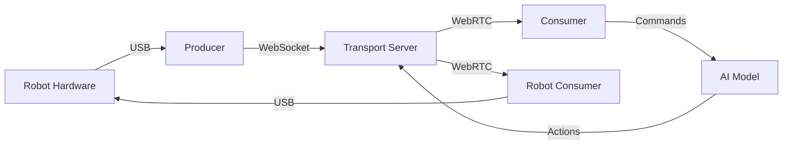

# Introducing RobotHub: Open-Source Robotics in the Browser

Building and controlling robots has traditionally required complex setups, specialized hardware, and deep technical knowledge. What if we could change that? What if robotics could be as accessible as opening a web browser and sharing a URL?

That's exactly what **RobotHub** aims to solve.

## What is RobotHub?

RobotHub is an open-source, end-to-end robotics stack that brings real-time robot control, 3D visualization, and AI-powered policies directly to your web browser. Think of it as "Google Docs for Robotics" – collaborative, instant, and accessible from anywhere.

```typescript
// Connect to a robot with just a few lines
const robot = await robotManager.createRobot("so-100");
await robot.connectUSB();
robot.updateJoint("shoulder", 45);
```

The platform consists of three main components:

1. **Frontend** (SvelteKit) – 3D visualization and control interface
2. **Transport Server** – Real-time WebSocket/WebRTC communication hub  
3. **Inference Server** – AI model hosting and inference

## Why I Built This

Traditional robotics development involves:
- Complex ROS installations and configurations
- Hardware-specific drivers and protocols
- Difficulty in sharing and collaborating
- High barriers to entry for newcomers

I wanted to create something different – a platform where:
- **Anyone** can control robots from their browser
- **Collaboration** happens through simple URL sharing
- **AI models** integrate seamlessly with hardware
- **Real-time** performance works across networks

## Key Features

### 🌐 Browser-Based Control
No installations, no ROS, no complex setup. Just open a browser and start controlling robots.

### 🤝 Instant Collaboration
Share a workspace URL and others instantly join the same robot session:
```
https://robothub.app/#workspace-abc123
```

### 🎯 Drag & Drop Architecture
Add robots, cameras, and AI models with simple drag-and-drop actions in a 3D scene.

### 🧠 AI-First Design
Built-in support for modern robotics AI:
- **ACT** (Actions Chunking with Transformers)
- **Pi-0** (Physical Intelligence models)
- **SmolVLA** (Vision-Language-Action models)

```typescript
// Create an AI session
const session = await compute.createSession({
  modelType: "act",
  policyPath: "LaetusH/act_so101_beyond", 
  cameraNames: ["front", "wrist"]
});
```

### 🔄 Real-Time Everything
WebRTC-powered streaming for:
- Joint position updates (< 10ms latency)
- Live camera feeds
- AI inference results

## Architecture Deep Dive

The magic happens through a **producer-consumer** pattern:



### Transport Server: The Neural Network
The Transport Server acts as a switchboard, routing messages between producers and consumers:

```typescript
// Robot sends joint states
producer.sendJointUpdate([
  { name: "shoulder", value: 45.2 },
  { name: "elbow", value: -30.1 }
]);

// AI receives and processes
consumer.onJointUpdate((joints) => {
  const prediction = await model.predict(joints, images);
  producer.sendJointUpdate(prediction);
});
```

### Inference Server: The Brain
AI models run on dedicated GPU servers but connect seamlessly:

```python
# FastAPI endpoint creates dedicated rooms
@app.post("/sessions")
async def create_session(request: CreateSessionRequest):
    # Create transport rooms for this AI session
    camera_rooms = await create_camera_rooms(request.camera_names)
    joint_input_room = await create_joint_room("input")
    joint_output_room = await create_joint_room("output")
    
    return {
        "camera_room_ids": camera_rooms,
        "joint_input_room_id": joint_input_room,
        "joint_output_room_id": joint_output_room
    }
```

## Real-World Applications

### 1. **Remote Teleoperation**
Control robots across continents with WebRTC's low-latency streaming.

### 2. **AI Training & Evaluation**
Deploy trained models instantly without complex infrastructure.

### 3. **Educational Robotics**
Students can access real robots from anywhere – no lab required.

### 4. **Collaborative Research**
Share robot sessions with global research teams in real-time.

## The Technology Stack

- **Frontend**: Svelte 5 + Threlte (3D) + TailwindCSS
- **Transport**: WebSocket + WebRTC + FastAPI
- **Inference**: PyTorch + HuggingFace + Docker
- **Hardware**: USB Serial + Feetech Servos

Special thanks to [Tim Qian](https://x.com/tim_qian) and the [bambot project](https://bambot.org/) for open-sourcing the excellent `feetech.js` library that powers our USB communication layer.

## Getting Started

```bash
# Clone with submodules
git clone --recurse-submodules https://github.com/julien-blanchon/RobotHub-Frontend

# Start the full stack
cd robothub-frontend
bun install && bun run dev

# Or try the hosted demo
# Frontend: https://blanchon-robothub-frontend.hf.space
# Transport: https://blanchon-robothub-transportserver.hf.space
# Inference: https://blanchon-robothub-inferenceserver.hf.space
```

## What's Next?

RobotHub is just getting started. The roadmap includes:

- **Mobile Support** – Control robots from phones/tablets
- **More AI Models** – Diffusion policies, foundation models
- **Simulation Integration** – MuJoCo, Isaac Sim support
- **Multi-Robot Coordination** – Swarm robotics in the browser

## Try It Yourself

The entire platform is open-source and ready to use:

- **GitHub**: [RobotHub Frontend](https://github.com/julien-blanchon/RobotHub-Frontend)
- **Demo**: [Try the live demo](https://blanchon-robothub-frontend.hf.space)
- **Docs**: [Getting Started Guide](https://github.com/julien-blanchon/RobotHub-Frontend#readme)

The future of robotics is collaborative, accessible, and happening in your browser. Welcome to RobotHub.

---

*Want to contribute or have questions? Join the discussion on [GitHub](https://github.com/julien-blanchon/RobotHub-Frontend) or reach out on [Twitter](https://twitter.com/julienblanchon).* 