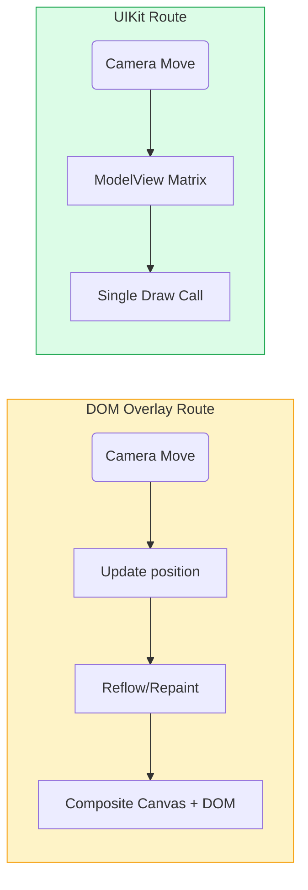
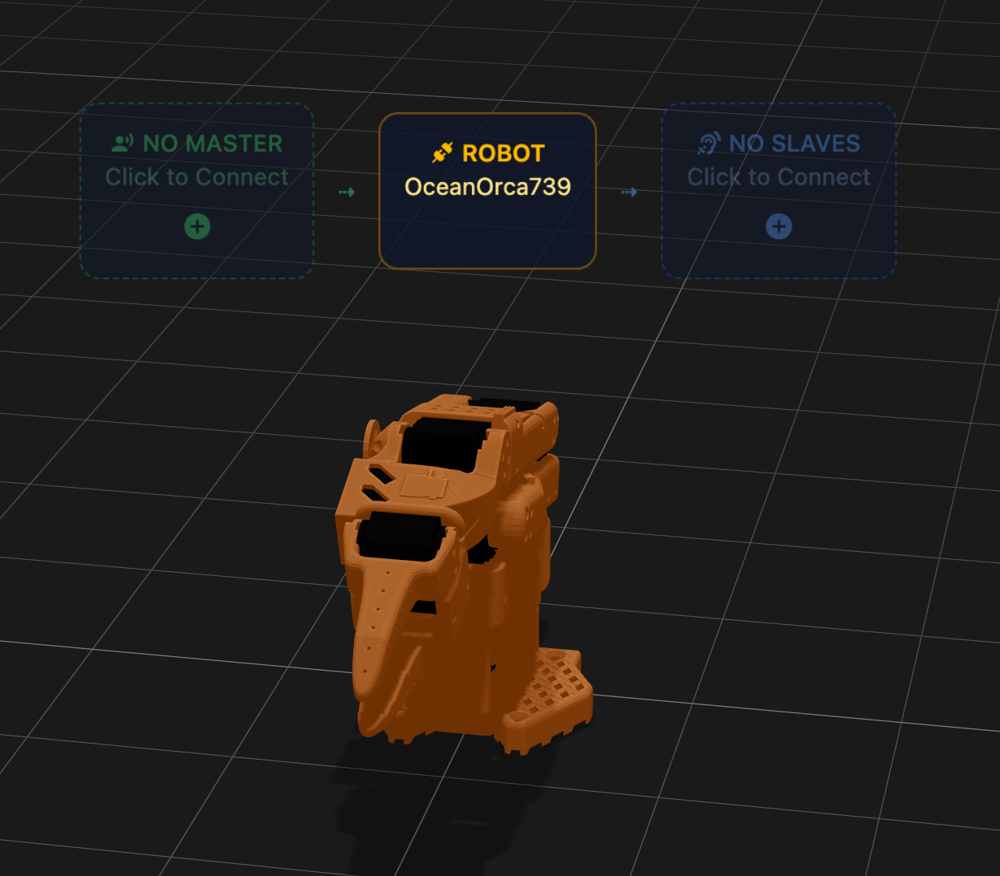
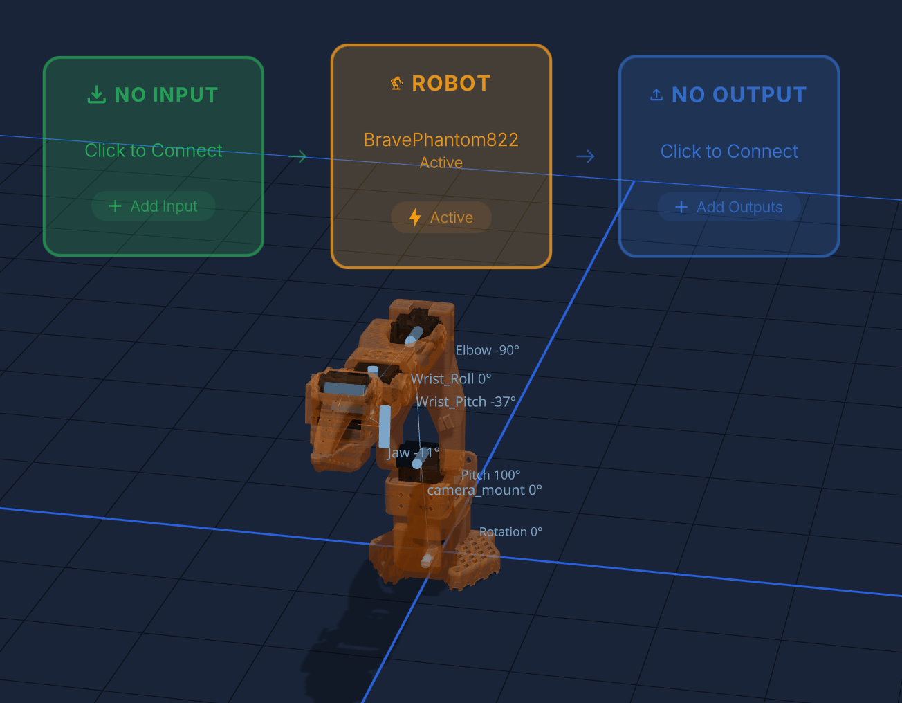

> When I started sprinkling **status panels** on top of my 3D robots in **RobotHub** I hit an unexpected wall: frame-rates nosedived each time I added a new HTML overlay. This post is a quick note on *why* that happens and how I fixed it with `threlte-uikit`.

## The hidden price of `<Html>`

`<Html>` (alias `<HTML>` in Threlte) [works by creating](https://v7.threlte.xyz/docs/reference/extras/html) an **absolutely-positioned DOM element** that is re-projected each frame so it appears to stick to a 3D object.  That sounds cheap, yet browsers must:

* recompute **layout & style** for every element when the camera moves (every frame at 60 Hz)
* perform an **expensive GPU compositing pass** – mixing the WebGL canvas with the DOM layer
* keep two coordinate systems in sync (CSS pixels ↔︎ world units)
* bridge pointer / focus events between WebGL and the DOM tree


Community war-stories echo this:

*  *"20 `<Html>` panels dropped Chrome from 120 fps to 50 fps"* – pmndrs discussion [link](https://github.com/pmndrs/react-three-fiber/discussions/3130)
*  Discourse thread on low FPS with many HTML overlays [link](https://discourse.threejs.org/t/many-html-elements-from-three-js-fiber-drei-causes-low-framerate-in-chrome/28540)

> **Rule of thumb** from R3F performance guide: *"If you can, keep UI inside the scene graph. Each DOM node is a liability."*  [link](https://r3f.docs.pmnd.rs/advanced/scaling-performance)



### Why it gets worse at scale

Adding ten robots in RobotHub meant 50+ status widgets (3 status widgets per robot) … Each widget held ~15 nested `<div>`s.  At 60 fps that is **45 000 layouts / s** before we even start rendering meshes.

<!-- https://blanchon-lerobot-arena.hf.space/ Old ui that is still using HTML for reader to try -->
<!-- https://blanchon-robothub-frontend.hf.space/ New ui that is using threlte-uikit -->

You can try it out yourself:
- [Old UI with HTML Status Widgets](https://blanchon-lerobot-arena.hf.space/)  
- [New UI with threlte-uikit Status Widgets](https://blanchon-robothub-frontend.hf.space/) 

<!-- ./images/new_ui.png -->


## Meet `threlte-uikit`

[threlte-uikit](https://github.com/threlte/threlte-uikit) ports pmndrs' WebGL-native [UIKit](https://github.com/pmndrs/uikit) to Threlte.  Widgets are instanced quads rendered in the same pass as your meshes—no DOM, no compositor juggling.

```svelte
<script>
  import { Root, Container, Text, Image, SVG, Video, Fullscreen } from 'threlte-uikit';
</script>

// Use in a Threlte Context (inside a <Canvas>)
<Root padding={12} backgroundColor="#111827">
  <Container direction="row" gap={8} align="center">
    <Image src="/icons/gpu.svg" width={24} height={24}/>
    <Text text="RTX-A4000" size={14}/>
    <SVG src="/icons/thermometer.svg" width={12}/>
    <Text text="66 °C" color="#f87171" size={12}/>
  </Container>
</Root>
```
